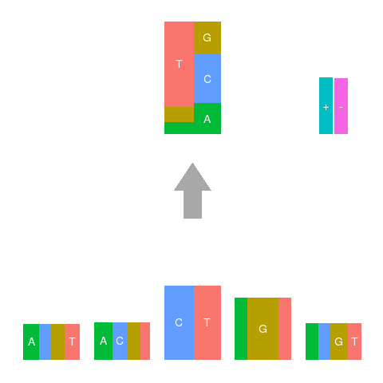

```{r style, echo = FALSE, results = 'asis'}
library(BiocStyle)
```

```{r, echo = FALSE}
library(knitr)
```


# Introduction

The R package **decompTumor2Sig** has been developed to decompose individual
tumor genomes (i.e., the lists of somatic single nucleotide variants identified
in individual tumors) according to a set of given mutational signatures---a
problem termed signature refitting---using a quadratic-programming approach.

Mutational signatures can be either of the form initially proposed by Alexandrov
et al. (Cell Rep. 3:246--259, 2013 and Nature 500:415--421, 2013)---in the
following called "Alexandrov signatures"---or of the simplified form proposed
by Shiraishi et al. (PLoS Genet. 11:e1005657, 2015)---in the following called
"Shiraishi signatures".

For each of the given mutational signatures, **decompTumor2Sig** determines
their contribution to the load of somatic mutations observed in a tumor.

**Please read the following important notes first**:

*Note*: here and in the following, when referring to "mutations", we intend
single nucleotide variants (SNVs).

*Note*: given the number of parameters to be estimated, **decompTumor2Sig** 
should best be applied only to tumor samples with a sufficient number of somatic
mutations. From our experience, using tumor samples with 100+ somatic mutations
was reasonable when using version 2 of the COSMIC Mutational Signatures
(30 signatures). Tumor samples with fewer somatic mutations should be avoided
unless a tumor-type specific subset of signatures is used.

*Note*: be aware that publicly available signature sets have often been defined
with respect to genome wide mutation frequencies, so they should best be applied
to somatic mutation data from whole genome sequencing. Background frequencies
may be different for subsets of the genome, i.e., current signature sets might
yield incorrect results when applied to, for example, mutation data from
targetted sequencing of only a subset of genes!

*Note*: for all functions provided by **decompTumor2Sig**, please see the
manual or the inline R help page for further details and explanations.


## Papers / how to cite

> Krüger S, Piro RM (2019) decompTumor2Sig: Identification of mutational
signatures active in individual tumors. *BMC Bioinformatics*
**20**(Suppl 4):152.

> Krüger S, Piro RM (2017) Identification of mutational signatures active in
individual tumors. *PeerJ Preprints* **5**:e3257v1 (Proceedings of the NETTAB
2017 Workshop on Methods, Tools \& Platforms for Personalized Medicine in the
Big Data Era, October 16-18, 2017 in Palermo, Italy).

BibTeX:
```
@UNPUBLISHED(krueger-decompTumor2Sig-paper,
   author = "Kr{\"u}ger, Sandra and Piro, Rosario Michael",
   title = "decompTumor2Sig: Identification of mutational signatures active in individual tumors",
   journal = "BMC Bioinformatics",
   volume = "20",
   number = "Suppl 4",
   pages = "152",
   year = 2019
);

@ARTICLE(krueger-decompTumor2Sig-nettab,
   author = "Kr{\"u}ger, Sandra and Piro, Rosario Michael",
   title = "Identification of mutational signatures active in individual tumors",
   journal = "PeerJ Preprints",
   volume = "5",
   pages = "e3257v1",
   year = 2017
);
```

# Installing and loading the package {#installation}

## Installation

### Bioconductor

**decompTumor2Sig** requires several CRAN and Bioconductor R packages to be
installed. Dependencies are usually handled automatically, when installing the
package using the following commands:

```
install.packages("BiocManager")
BiocManager::install("decompTumor2Sig")
```
[NOTE: Ignore the first line if you already have installed the
`r CRANpkg("BiocManager")`.]

### Manual installation

In the unlikely case that a manual installation is required, e.g., if you do
not install **decompTumor2Sig** via Bioconductor (which is highly recommended),
before installing **decompTumor2Sig** make sure the following packages are
installed:

CRAN packages:

`r CRANpkg("Matrix")`, `r CRANpkg("quadprog")`, 
`r CRANpkg("plyr")`, `r CRANpkg("ggplot2")`, `r CRANpkg("ggseqlogo")`,
`r CRANpkg("gridExtra")`

Bioconductor packages:

`r Biocpkg("GenomicRanges")`, `r Biocpkg("GenomicFeatures")`,
`r Biocpkg("GenomeInfoDb")`, 
`r Biocpkg("Biostrings")`, `r Biocpkg("BiocGenerics")`,
`r Biocpkg("S4Vectors")`, `r Biocpkg("BSgenome.Hsapiens.UCSC.hg19")`,
`r Biocpkg("TxDb.Hsapiens.UCSC.hg19.knownGene")`,
`r Biocpkg("VariantAnnotation")`,  `r Biocpkg("SummarizedExperiment")`

If you intend to work with Shiraishi-type signatures, you may also want to
install the R package `r Rpackage("pmsignature")` which is neither part of
CRAN nor of Bioconductor and must be downloaded and installed manually
(available at: <https://github.com/friend1ws/pmsignature>).

CRAN packages can be installed from R using the following command:

```
install.packages("<package_name>")
```

Bioconductor packages can be installed from R using the following command:

```
BiocManager::install("<package_name>")
```

Sometimes, it may also be useful to update Bioconductor:

```
BiocManager::install()
```

Finally, the manual installation of **decompTumor2Sig** can, for example, be
done from the command line ...
```
R CMD INSTALL decompTumor2Sig_<version>.tar.gz
```
... or the newest version can directly be installed from GitHub using the
CRAN package  `r CRANpkg("devtools")`:
```
library(devtools)
install_github("rmpiro/decompTumor2Sig")
```


## Loading the package

After installation, loading the package is simple:
```{r, results='hide', message=FALSE}
library(decompTumor2Sig)
```

# Input data {#input}

**decompTumor2Sig** works with two kinds of input data:

i) a set of given mutational signatures, and
ii) a set of somatic mutations (single nucleotide variants) observed in a tumor
genome.

Additionally, **decompTumor2Sig** requires the genomic sequence (in form of a
`r Rpackage("BSgenome")` object) to determine neighboring nucleotides of the
mutated bases. It may also require transcript annotations (in form of a
`r Rpackage("TxDb")` object) in case the given mutational signatures take
information on the transcription direction into account.


## Mutational signatures {#input-sign}

Mutational signatures can be read in two different formats: Alexandrov-type
signatures and Shiraishi-type signatures.

### Alexandrov signatures {#input-sign-alexandrov}

Alexandrov signatures are specified either in the format used at the
COSMIC Mutational Signatures website for signatures version 2 (March 2015,
see <http://cancer.sanger.ac.uk/cosmic/signatures_v2> -> "Download signatures"),
or in the format used for signatures version 3 (May 2019; see
<https://cancer.sanger.ac.uk/cosmic/signatures/SBS/> and
<https://www.synapse.org/#!Synapse:syn12009743>). Also the signatures of
version 3.1 (distributed as an Excel spread sheet on the COSMIC Mutational
Signatures website) can be read. For versions 3 and 3.1, only Single Base
Substitution (SBS) signatures can be used.

Example for version 2:

```
Substitution Type  Trinucleotide  Somatic Mutation Type  Signature 1     ...
C>A                ACA            A[C>A]A                0.011098326166  ...
C>A                ACC            A[C>A]C                0.009149340734  ...
C>A                ACG            A[C>A]G                0.001490070468  ...
C>A                ACT            A[C>A]T                0.006233885236  ...
...
T>G                TTG            T[T>G]G                0.002031076880  ...
T>G                TTT            T[T>G]T                0.004030128160  ...
```

Example for version 3:

```
Type,SubType,SBS1,SBS2,SBS3,SBS4,SBS5,SBS6, ...
C>A,ACA,8.86E-04,5.80E-07,2.08E-02,4.22E-02,1.20E-02,4.25E-04, ...
C>A,ACC,2.28E-03,1.48E-04,1.65E-02,3.33E-02,9.44E-03,5.24E-04, ...
C>A,ACG,1.77E-04,5.23E-05,1.75E-03,1.56E-02,1.85E-03,5.20E-05, ...
C>A,ACT,1.28E-03,9.78E-05,1.22E-02,2.95E-02,6.61E-03,1.80E-04, ...
...
T>G,TTG,5.83E-04,9.54E-05,8.05E-03,2.32E-03,6.94E-03,3.24E-04, ...
T>G,TTT,2.23E-16,2.23E-16,1.05E-02,5.68E-04,1.35E-02,1.01E-03, ...
```

(Apart from the change of tab- to comma-separator, the main difference is
the lack of the redundant 3rd annotation column in version 3. Version 3.1 has
the same format as version 3, but is distributed as an Excel spread sheet.)

The standard Alexandrov-type signatures report mutation frequencies for
nucleotide triplets where the mutated base is at the center. Also, the basic
Alexandrov signatures do not take transcription direction into account when
computing mutation frequencies.


To read Alexandrov-type signatures, use the command
**readAlexandrovSignatures()**. By default, the command reads the version 2 (!)
signatures directly from COSMIC and stores them in a list object:

```{r, message=FALSE, warning=FALSE}
signatures <- readAlexandrovSignatures()
length(signatures)
signatures[1]
```

Alternatively, the signatures can be read from a file of the format shown
above (TSV, CSV or Excel spread sheet):

```{r, eval=FALSE}
signatures <- readAlexandrovSignatures(file="<signature_file>")
```


### Shiraishi signatures {#input-sign-shiraishi}

Shiraishi signatures are specified as matrices (in flat files without headers
and row names; one file per signature).

Format (see Shiraishi et al. PLoS Genetics 11(12):e1005657, 2015):

* The first row:
Frequencies of the six possible base changes C>A, C>G, C>T, T>A, T>C, and T>G.
Please note that due to the complementarity of base pairing these six base
changes already include A>? and G>?.

* The following *2k* rows (for *k* up- and downstream flanking bases):
Frequencies of the bases A, C, G, and T, followed by two 0 values.

* The optional last row (only if transcription direction is considered):
Frequencies of occurrences on the transcription strand, and on the
opposite strand, followed by four 0 values.

Example:
```
0.05606328   0.07038910   0.39331059   0.13103780   0.20797476   0.14122446
0.27758477   0.21075424   0.23543226   0.27622874   0            0
0.33081021   0.25347427   0.23662536   0.17909016   0            0
0.21472304   2.6656e-09   0.55231053   0.23296643   0            0
0.22640542   0.20024237   0.32113377   0.25221844   0            0
0.50140066   0.49859934   0            0            0            0
```

Among its examples, the **decompTumor2Sig** package provides a small set of
four Shiraishi-type signatures in flat files. These signatures were obtained
from 21 breast cancer genomes (Nik-Zainal et al. Cell 149:979--993, 2012) using
the R package `r Rpackage("pmsignature")` (Shiraishi et al. PLoS Genet.
11:e1005657, 2015).

To read these flat files as signatures, you can use the following example:

```{r}
# take the example signature flat files provided with decompTumor2Sig
sigfiles <- system.file("extdata",
                 paste0("Nik-Zainal_PMID_22608084-pmsignature-sig",1:4,".tsv"),
                 package="decompTumor2Sig")

# read the signature flat files
signatures <- readShiraishiSignatures(files=sigfiles)
signatures[1]
```

### Get signatures from the package `r Rpackage("pmsignature")` {#input-pmsig}

The third possibility is to convert Shiraishi-type signatures directly from
the package that computes them (`r Rpackage("pmsignature")`; Shiraishi et al.
PLoS Genet. 11:e1005657, 2015).

Example workflow:

```{r}
# load example signatures for breast cancer genomes from Nik-Zainal et al
# (PMID: 22608084) in the format produced by pmsignature (PMID: 26630308)
pmsigdata <- system.file("extdata",
          "Nik-Zainal_PMID_22608084-pmsignature-Param.Rdata", 
          package="decompTumor2Sig")
load(pmsigdata)
 
# extract the signatures from the pmsignature 'Param' object
signatures <- getSignaturesFromEstParam(Param)
signatures[1]
```


Please note that `r Rpackage("pmsignature")` is neither part of CRAN nor of
Bioconductor and must be downloaded and installed manually (available at:
<https://github.com/friend1ws/pmsignature>). To load mutational signatures
without `r Rpackage("pmsignature")` being installed, see the previous sections.


### Conversion of Alexandrov signatures to Shiraishi signatures {#sign-Alex2Shi}

An Alexandrov-type signature can be converted into a Shiraishi-type signature
(but not *vice versa* due to the loss of information). Consider the following
example:

```{r, message=FALSE, warning=FALSE}
sign_a <- readAlexandrovSignatures()
sign_s <- convertAlexandrov2Shiraishi(sign_a)
sign_s[1]
```

*Note*: since the standard Alexandrov-type signatures regard nucleotide
triplets and do not take transcription direction into account, the obtained
Shiraishi-type signatures will also be limited to triplets without information
about transcription direction.

**Important**: Please be aware that signatures are initially not determined in
isolation but as a set of signatures derived from a commonly large set of tumor
genomes (Alexandrov et al. Cell Rep. 3:246--259, 2013; Alexandrov et al. Nature
500:415--421, 2013; Shiraishi et al. PLoS Genet. 11:e1005657, 2015). Therefore,
the biological meaning of converting signatures is not well defined, and the
approach should be taken with caution! As an example for the possible outcome,
please see our paper (Krüger and Piro, 2019).


### Adjustment/normalization of mutational signatures for subsets of the genome

The exact numeric features of mutational signatures (e.g., the 96 mutation
probabilities of trinucleotide mutation types within an Alexandrov-type
signature) depend not only on the mutational processes themselves, but also
on the nucleotide frequencies within the reference sequences of the mutation
data from which the signatures were derived.

Consider, for example, a hypothetical biochemical mutational process which can
potentially cause C[C>T]G and A[C>T]A mutations with equal probability.
Even if both mutation types are potentially equiprobable, in CG-rich regions
more C[C>T]G than A[C>T]A mutations will be observed, simply because these
regions likely contain more CCG trinucleotides than ACA trinucleotides which
can be mutated. This illustrates that the observed fractions of mutations do
not only depend on the underlying mutational process alone, but also on the
nucleotide frequencies within the reference sequences from which the mutational
signatures were inferred in the first place (e.g., whole genome, whole exome,
another subset of genomic regions?).

Sometimes, however, it may be useful to apply signature refitting to
mutation data from genomic regions whose nucelotide frequencies differ from
those for which mutational signatures are available. For example, signature
refitting might need to be applied to mutation data from whole exome
sequencing, or targetted sequencing (only a specific set of genes) although
mutational signatures were derived for data from the whole reference genome.

For this purpose, the function **adjustSignaturesForRegionSet()** provides
the possibility to (re-)adjust/normalize mutational signatures for a given
reference sequence (e.g., whole genome) to the nucleotide frequencies present
in another target set of genomic regions (e.g., whole exome) to which
signature refitting has to be applied.


**Adjustment/normalization of Alexandrov-type signatures:**

For Alexandrov-type signatures, the important frequencies are those of
multi-nucleotide sequence patterns (usually trinucleotides) whose central base
can be mutated. Therefore, adjustment factors for individual multi-nucleotide
mutation types (e.g., A[C>T]G) are computed by comparing the corresponding
multi-nucleotide frequencies (e.g., ACG) between the original reference regions
and the target regions.

Mathematical approach: divide the mutation probabilities of individual mutation
features (e.g., trinucleotide mutation types for Alexandrov signatures) by the
original (genome-wide?) multi-nucleotide frequency, then multiply it by
the corresponding frequency in the target region set. That is, if the target
regions, for example, have a doubled frequency of a certain trinucleotide
(e.g., ACG) with respect to the original reference sequence, the mutation
probabilities of the corresponding mutation types (A[C>A]G, A[C>G]G, A[C>T]G)
in an Alexandrov signature will be multiplied by 2. Reasoning: the mutational
process has more opportunities to mutate that trinucleotide in the target
regions than in the original reference sequence for which the signature was
initially derived. After the appropriate adjustment of individual features,
an Alexandrov signature is re-normalized such that overall probability over
all mutation types sum up to 1.


**Adjustment/normalization of Shiraishi-type signatures:**

In the Shiraishi-type signature model, individual bases of the multi-nucleotide
sequence patterns are considered as independent features. Therefore, the
adjustment of such signatures should be applied to individual bases while still
reflecting the presence of absence (hence, the frequencies) of the full sequence
patterns in the genomic regions. Thus, to compute single-nucleotide frequencies
for the adjustment, first the frequencies of the multi-nucleotide sequence
patterns are determined (as for Alexandrov-type signatures) and then broken
down to single-nucleotide frequencies for the individual positions of the
patterns. That is, for each position in the sequence patterns a set of
single-nucleotide frequencies is determined to describe, for example, how
frequent a specific nucleotide occurs at a specific position in the pattern
(very much like in position-frequency matrices used for transcription factor
binding motives).

Mathematical approach: for signature adjustment, the position-specific
nucleotide frequencies are applied to the position-specific mutation
probabilities of a Shiraishi signature much in the same way as described above
for the adjustment of multi-nucleotide frequencies in Alexandrov signatures.
After the appropriate adjustment of individual position-specific features,
a Shirishi signature is re-normalized such that for each individual position
in the pattern the overall base change probability (for the central base) or
nucleotide probabilities (for flanking bases) sum up to 1.

**Usage example:**

Example for adjusting Alexandrov signatures (derived from mutation data from
the whole genome) to the nucleotide frequencies present in promoter regions:

```{r, message=FALSE, warning=FALSE}
# get Alexandrov signatures from COSMIC
signatures <- readAlexandrovSignatures()

signatures$Signature.1[1:5]


# get gene annotation for the default reference genome (hg19)
txdb <- TxDb.Hsapiens.UCSC.hg19.knownGene::TxDb.Hsapiens.UCSC.hg19.knownGene

# get a GRanges object for gene promoters (-2000 to +200 bases from TSS)
library(GenomicRanges)
regionsTarget <- promoters(txdb, upstream=2000, downstream=200)

# adjust signatures according to nucleotide frequencies in this subset of
# the genome
sign_adj <-
   adjustSignaturesForRegionSet(signatures,
            regionsTarget, regionsOriginal=NULL,
            refGenome=BSgenome.Hsapiens.UCSC.hg19::BSgenome.Hsapiens.UCSC.hg19)

sign_adj$Signature.1[1:5]
```

**adjustSignaturesForRegionSet()** accepts both types of signatures with the
following arguments:

* *signatures*: The signature set (list) to be adjusted/normalized.
* *regionsTarget*: A **GRanges** object (package `r Biocpkg("GenomicRanges")`)
containing the target regions for which to adjust the signatures. This can
also be NULL if the new target regions correspond to the whole genome.
* *regionsOriginal*: Optional **GRanges** object containing the genomic regions
for which the signatures were originally derived. By default (NULL) this is the whole genome.
* *refGenome*: Optional **BSgenome** object with the reference genome from
which to extract sequences for both the original and the target regions. By
default, the human refernce genome hg19 is taken.


### Verifying the signature format

For certain applications it may be necessary to construct signatures or
convert them from other kind of data. To do so, each signature must be either
a numeric *vector* of probabilities which sum up to 1 (for Alexandrov-type
signatures) or a *matrix* or *data.frame* with six numeric columns, every row
of which sums up to 1 (for Shiraishi-type signatures).

A set of signatures is then simply a *list* of such signatures.

To verify whether a signature set has a format that can be used with
**decompTumor2Sig** the package provides the following set of functions. Since
the mutation frequencies in genomes are specified in exactly the same way,
these functions can be used for both signatures and genomes:

* **isAlexandrovSet()**: Verify whether a list object (set of signatures or
genomes) is compatible with the Alexandrov model.
* **isShiraishiSet()**: Verify whether a list object (set of signatures or
genomes) is compatible with the Shiraishi model.
* **isSignatureSet()**: Verify whether a list object (set of signatures or
genomes) is compatible with either the Alexandrov or the Shiraishi model.
* **sameSignatureFormat()**: Verify whether two list objects (two sets of
signatures or genomes) contain signatures/genomes of the same format.

Examples:
```{r}
isAlexandrovSet(sign_a)
isSignatureSet(sign_a)
isShiraishiSet(sign_s)
isSignatureSet(sign_s)
sameSignatureFormat(sign_a, sign_s)
```

## Somatic mutations from individual tumors {#input-mut}

Information on the somatic mutations found in a tumor can be read from one of
the following formats and converted to mutation frequencies for
**decompTumor2Sig**.

### Variant Call Format (VCF) {#input-mut-vcf}

The somatic mutations of a tumor genome can be read from a VCF file. For
detailed information on this format (including an example), see
<https://samtools.github.io/hts-specs/VCFv4.2.pdf>.

Mutations from multiple tumor genomes can also be read from a multi-sample VCF
file.

As an example, the **decompTumor2Sig** package provides the somatic mutations
for a subset of six of the 21 breast cancer genomes originally published by
Nik-Zainal et al (Cell 149:979--993, 2012). The dataset has been converted
from MPF (see below) to VCF.

Example workflow:

```{r}
# load the reference genome and the transcript annotation database
refGenome <- BSgenome.Hsapiens.UCSC.hg19::BSgenome.Hsapiens.UCSC.hg19
transcriptAnno <-
           TxDb.Hsapiens.UCSC.hg19.knownGene::TxDb.Hsapiens.UCSC.hg19.knownGene

# take the six breast cancer genomes from Nik-Zainal et al (PMID: 22608084) 
gfile <- system.file("extdata",
                     "Nik-Zainal_PMID_22608084-VCF-convertedfromMPF.vcf.gz",
                     package="decompTumor2Sig")

# read the cancer genomes in VCF format
genomes <- readGenomesFromVCF(gfile, numBases=5, type="Shiraishi",
                              trDir=TRUE, refGenome=refGenome,
                              transcriptAnno=transcriptAnno, verbose=FALSE)
length(genomes)
genomes[1:2]
```

When reading somatic mutations of tumor genomes with **readGenomesFromVCF()**,
they are preprocessed to determine mutation frequencies according to specific
sequence characteristics which can be controlled by the following arguments:

* *type*: Type of signatures that will be used with the genomes, "Shiraishi" or
"Alexandrov".
* *numBases*: The odd number of nucleotides/bases of the mutated sequence
(where the mutated base is at the center). 
* *trDir*: Whether the transcription direction should be taken into account
(default: TRUE). If so, only mutations located within genomic regions for which
a transcript direction is defined will be considered.
* *refGenome*: The reference genome from which to obtain the flanking bases of
the mutated base.
* *transcriptAnno*: The transcript annotation database from which to obtain the
transcription direction (if needed, i.e., if *trDir*=TRUE).
* *enforceUniqueTrDir*: If *trDir* is TRUE, then by default each mutation which
maps to a region with multiple overlapping genes with opposing transcription
directions will be excluded from the analysis. This is because from mutation
data alone it cannot be inferred which of the two genes has the higher
transcription activity which might potentially be linked to the occurrence of
the mutation. Until version 1.3.5 of **decompTumor2Sig** the behavior for
mutations associated with two valid transcription directions was different: the
transcript direction encountered first in the transcript database (specified
with *transcriptAnno*) was assigned to the mutation; the latter is also the
default behavior of the `r Rpackage("pmsignature")` package. If you need to
reproduce the old behavior---which basically arbitrarily assigns one of the two
transcriptions strands---then you can set *enforceUniqueTrDir*=FALSE (this
option exists mostly for backward compatibility with older versions), but it is
recommended to entirely exclude mutations without ambiguous transcription
strands. Note: this option is ignored when *trDir*=FALSE, where all mutations
can be used.


### Mutation Position Format (MPF) {#input-mut-mpf}

Alternatively, somatic mutations can be read from an MPF file.

Example MPF file:

```
patient1   chr1   809687    G   C
patient1   chr1   819245    G   T
patient1   chr2   2818266   A   G
patient1   chr2   3433314   G   A
patient2   chr1   2927666   A   G
patient2   chr1   3359791   C   T
```

The five columns contain

1. the name of the sample (or tumor ID); 
1. the chromosome name; 
1. the position on the chromosome; 
1. the reference base at that position (A, C, G, or T); 
1. the alternate or variant base (A, C, G, or T).

Hence, with an MPF file, too, multiple tumors can be described.

As an example, the **decompTumor2Sig** package provides the somatic mutations
for six of the 21 breast cancer genomes originally published by Nik-Zainal et
al (Cell 149:979--993, 2012).

Example workflow:

```{r}
# load the reference genome and the transcript annotation database
refGenome <- BSgenome.Hsapiens.UCSC.hg19::BSgenome.Hsapiens.UCSC.hg19
transcriptAnno <-
           TxDb.Hsapiens.UCSC.hg19.knownGene::TxDb.Hsapiens.UCSC.hg19.knownGene

# take the six breast cancer genomes from Nik-Zainal et al (PMID: 22608084) 
gfile <- system.file("extdata", "Nik-Zainal_PMID_22608084-MPF.txt.gz", 
                     package="decompTumor2Sig")

# read the cancer genomes in MPF format
genomes <- readGenomesFromMPF(gfile, numBases=5, type="Shiraishi",
                              trDir=TRUE, refGenome=refGenome,
                              transcriptAnno=transcriptAnno, verbose=FALSE)
```

Note: the preprocessing of the somatic mutations into mutation frequencies can
be controlled with the same function arguments that have been described above
for **readGenomesFromVCF()**.


### Get somatic mutations from the package `r Rpackage("pmsignature")` {#mutpm}

The third possibility to get the somatic mutations from one or more tumor
genomes is to convert them directly from a tumor data object
(*MutationFeatureData* object) loaded using the `r Rpackage("pmsignature")`
package (Shiraishi et al. PLoS Genet. 11:e1005657, 2015).

An example of such an object is provided with **decompTumor2Sig**:

```{r}
# get breast cancer genomes from Nik-Zainal et al (PMID: 22608084) 
# in the format produced by pmsignature (PMID: 26630308)
pmsigdata <- system.file("extdata", 
                         "Nik-Zainal_PMID_22608084-pmsignature-G.Rdata", 
                         package="decompTumor2Sig")
load(pmsigdata)

# extract the genomes from the pmsignature 'G' object
genomes <- getGenomesFromMutFeatData(G, normalize=TRUE)
genomes[1]
```


Please note that `r Rpackage("pmsignature")` is neither part of CRAN nor of
Bioconductor and must be downloaded and installed manually (available at:
<https://github.com/friend1ws/pmsignature>). To read tumor genomes without
`r Rpackage("pmsignature")` being installed, see the previous sections about
VCF and MPF and the following section.

**Important**: the argument *normalize*, that can be specified for
**getGenomesFromMutFeatData()**, controls whether the function should simply
count the number of occurrences or whether it provides (normalized)
fractions/percentages of mutations among the total set. Normalization is the
default and is what **should be used** for determining the contribution of
individual signatures to the mutational load of a tumor. *normalize*=FALSE
should be used only in case you are interested in how many somatic mutations
of the single signature categories can be found in a tumor; it should not be
used for further processing with **decompTumor2Sig**!

**Important**: There is a slight difference on how `r Rpackage("pmsignature")`
and **decompTumor2Sig** preprocess mutations for counting them when taking the
transcription direction into account: For mutations which map to a region with
multiple overlapping genes with opposing transcription directions,
`r Rpackage("pmsignature")` assigns the transcript direction of the gene
encountered first in the transcript database (see also Section 3.2.1). This
was also the behavior of **decompTumor2Sig** until version 1.3.5 (used for
our papers; Krüger and Piro, 2017, 2019). In newer versions,
**decompTumor2Sig** excludes these mutations
by default from the count because from mutation data alone it cannot be
inferred which of the two genes has the higher transcriptional activity which
might potentially be linked to the occurrence of the mutation. However, when
converting data from `r Rpackage("pmsignature")` these mutations have already
been processed and can therefore not be excluded during the conversion.


### Get somatic mutations from a VRanges object {#input-mut-vranges}

The Bioconductor package `r Biocpkg("VariantAnnotation")` provides the class
**VRanges** which can be used to store mutation information. **decompTumor2Sig**
allows to extract single nucleotide variants (SNVs) from such an object and
convert them into the tumor genomes' mutation frequencies using the function
**convertGenomesFromVRanges()**, as in the following example workflow:

```{r, message=FALSE}
# load the reference genome and the transcript annotation database
refGenome <- BSgenome.Hsapiens.UCSC.hg19::BSgenome.Hsapiens.UCSC.hg19
transcriptAnno <-
           TxDb.Hsapiens.UCSC.hg19.knownGene::TxDb.Hsapiens.UCSC.hg19.knownGene

# take six breast cancer genomes from Nik-Zainal et al (PMID: 22608084) 
gfile <- system.file("extdata",
                     "Nik-Zainal_PMID_22608084-VCF-convertedfromMPF.vcf.gz", 
                     package="decompTumor2Sig")

# get the corresponding VRanges object (using the VariantAnnotation package)
library(VariantAnnotation)
vr <- readVcfAsVRanges(gfile, genome="hg19")

# convert the VRanges object to the decompTumor2Sig format
genomes <- convertGenomesFromVRanges(vr, numBases=5, type="Shiraishi",
                                     trDir=TRUE, refGenome=refGenome,
                                     transcriptAnno=transcriptAnno,
                                     verbose=FALSE)
```

Note: the preprocessing of the somatic mutations into mutation frequencies can
be controlled with the same function arguments that have been described above
for **readGenomesFromVCF()**.


### Verifying the mutation data ("genomes") format

Since the mutation data of genomes is specified as mutation probabilities
and has exactly the same format as signatures, the format can be verified with
the very same functions described in Section 3.1.6 (see above).


# Workflow {#workflow}

(*Note*: The following examples are for illustrative purpose only and need not
be biologically meaningful.)

Once both the tumor genome(s) and the given mutational signatures have been
read (see above), the contribution of the given signatures to the somatic
mutations in individual tumors can be determined using the following workflow.

In the following, we assume to have the signatures in a list object named
*signatures* and the mutation frequencies of the tumor genome(s) in another
list object named *genomes*.

**Important note**: it is imperative that the mutation frequencies represented
by both *signatures* and *genomes* have been computed with the same
characteristics. That is, if the *signatures* refer to sequences of 5
nucleotides/bases (with the mutated base at the center), then also the
*genomes* must have been read for 5 bases. If the *signatures* have been
produced taking the transcription direction into account, then also the
*genomes* must have been read taking the transcription direction into account,
and so on.


## Visualizing genome characteristics and mutational signatures

Given that the signatures and the genomes (if read appropriately) have the same
format and contain the same type of information (fractions/percentages of
somatic mutations that have specific features, e.g., specific neighboring
bases), both can essentially be visualized in the same way.

The function **plotMutationDistribution()** takes as an input either a single
signature or the mutation frequencies of an individual tumor genome (either of
Alexandrov- or of Shiraishi-type) and plots the mutation frequency data
according to the signature model.

To plot, for example, Alexandrov/COSMIC signature 1 (obtained as described in
Section 3.1.1):

```{r}
signatures <- readAlexandrovSignatures()
plotMutationDistribution(signatures[[1]])
```

To plot one of the Shiraishi signatures provided with this package (see Section
3.1.2):

```{r}
sigfiles <- system.file("extdata",
                 paste0("Nik-Zainal_PMID_22608084-pmsignature-sig",1:4,".tsv"), 
                 package="decompTumor2Sig")
signatures <- readShiraishiSignatures(files=sigfiles)

plotMutationDistribution(signatures[[1]])
```

**decompTumor2Sig**'s representation of the mutation frequency data of
Shiraishi-type signatures uses sequence logos for the flanking bases and the
variant bases (with the heights of the bases being proportional to their
probability/frequency). The two possibilities for the mutated central base
(**C** or **T**) are represented next to each other and their respective
frequency is indicated below. This side-by-side representation allows to
distinguish the probabilities of variant bases (on top) according to the
mutated base. Transcription strand bias (if information on transcription
direction is used) is shown in the upper right corner (frequency of mutations
on the transcription strand, "+", and the opposite strand, "-").

In the plot above, for example, **C** and **T** are nearly equally likely
to be mutated by the represented mutational process, but a mutated **C** most
frequently becomes a **T**, while a mutated **T** becomes one of the other
bases with roughly equal probability. Also, the mutational signature has next
to no strand bias.

This representation is similar to the way the `r Rpackage("pmsignature")`
package represents such signatures, as shown by the following example:

```{r, echo=FALSE}

```
(This plot above was generated with `r Rpackage("pmsignature")` and serves only
for comparison, showing the same signature as above.)


To show that genome mutation frequencies can be represented in the same manner,
the following example reads the tumor genomes provided with this package (see
Section 3.2.1) using the Alexandrov model and plots the mutation frequencies of
the first genome:

```{r}
refGenome <- BSgenome.Hsapiens.UCSC.hg19::BSgenome.Hsapiens.UCSC.hg19
gfile <- system.file("extdata",
                     "Nik-Zainal_PMID_22608084-VCF-convertedfromMPF.vcf.gz", 
                     package="decompTumor2Sig")
genomes <- readGenomesFromVCF(gfile, numBases=3, type="Alexandrov",
         trDir=FALSE, refGenome=refGenome, verbose=FALSE)

plotMutationDistribution(genomes[[1]])
```


## Explained variance as a function of the number of signatures

In many cases already a small subset of the given signatures is sufficient to
explain the major part of the variance of the mutation frequencies observed
in a single tumor genome.

The explained variance can be determined by comparing the true mutation
frequencies $g_i$ of the tumor genome---where $i$ is one of the mutation
features of the signature model (e.g., triplet mutations for Alexandrov
signatures, or base changes or flanking bases for Shiraishi signatures)---to
the mutation frequencies $\hat{g}_i$ obtained when re-composing/reconstructing
the mutation frequencies of the tumor genome from the mutational signatures and
their computed exposures/contributions. (See Section 4.3 for computing the
exposures/contributions, and Section 4.4 for reconstructing the mutation
frequencies of a tumor.)

For the Alexandrov model, the explained variance can be estimated as:

$$ \mathrm{evar}=1-\frac{\sum_i{(g_i-\hat{g}_i)^2}}{\sum_i({g_i}-\bar{g})^2} $$

where the numerator is the residual sum of squares (RSS) between the predicted
and true mutation frequencies of the tumor genome (i.e., the squared error),
and the denominator can be interpreted as the deviation from a tumor genome
with a uniform mutation frequency of 1/96 for each feature (which is
precisely the average mutation frequency $\bar{g}$).

For the Shiraishi model, $\bar{g}$ does not describe a tumor genome with
uniform mutation frequencies, and hence the explained variance is estimated as:

$$\mathrm{evar}=1-\frac{\sum_i{(g_i-\hat{g}_i)^2}}{\sum_i({g_i}-{g}^{*}_i)^2}$$

where $g^{*}$ is a uniform tumor model that uses mutation frequencies of 1/6
for the six possible base changes, 1/4 for each of the possible flanking bases,
and 1/2 for each of the two possible transcription-strand directions. For more
details, please see Krüger and Piro (2019).

The function **plotExplainedVariance()** allows to visually analyze how many
signatures are necessary to explain certain fractions of the variance of a
tumor genome's mutational patterns.

For an increasing number *K* of signatures, the highest variance explained by
subsets of *K* signatures will be plotted. This can help to evaluate what
minimum threshold for the explained variance could be used to decompose tumor
genomes with the function **decomposeTumorGenomes()** (see below).

### Example: input data

As a simple example, load a set of 15 Shiraishi-type signatures (object
*signatures*) provided with this package. These signatures were obtained with
the package `r Rpackage("pmsignature")` from a set of 435 tumor genomes with at
least 100 somatic mutations from ten different tumor entities (data from
Alexandrov et al. Nature 500:415-421, 2013; for the analysis, see our papers
mentioned in Section 1.1):

```{r}
# load the 15 Shiraishi signatures obtained from 
# 435 tumor genomes from Alexandrov et al.
sfile <- system.file("extdata",
              "Alexandrov_PMID_23945592_435_tumors-pmsignature-15sig.Rdata", 
              package="decompTumor2Sig")
load(sfile)
length(signatures)
signatures[1]
```

This loads an object *signatures* with 15 Shiraishi signatures for mutated
subsequences of length 5 (five nucleotides with the mutated base at the center)
and taking transcription direction into account.

Now read the tumor genomes (object *genomes*) provided with this package, as
described in Section 3.2.1:
```{r}
# load the reference genome and the transcript annotation database
refGenome <- BSgenome.Hsapiens.UCSC.hg19::BSgenome.Hsapiens.UCSC.hg19
transcriptAnno <-
           TxDb.Hsapiens.UCSC.hg19.knownGene::TxDb.Hsapiens.UCSC.hg19.knownGene

# take six breast cancer genomes from Nik-Zainal et al (PMID: 22608084) 
gfile <- system.file("extdata",
                     "Nik-Zainal_PMID_22608084-VCF-convertedfromMPF.vcf.gz", 
                     package="decompTumor2Sig")

# read the cancer genomes in VCF format
genomes <- readGenomesFromVCF(gfile, numBases=5, type="Shiraishi",
                              trDir=TRUE, refGenome=refGenome,
                              transcriptAnno=transcriptAnno, verbose=FALSE)
```

### Example: plot the explained variance

The explained variance can be plotted only for a single tumor genome. Plotting
the explained variance of the first tumor genome when using increasing subsets
of the 15 mutational signatures (see above), for example, can be done with the
following command: 

```{r, fig.asp=1}
plotExplainedVariance(genomes[[1]], signatures, minExplainedVariance=0.9,
                                    minNumSignatures=2, maxNumSignatures=NULL,
                                    greedySearch=TRUE)
```

The function **plotExplainedVariance()** takes the following arguments:

* *genome*: The mutation frequencies of a single tumor genome (according to the
Alexandrov or Shiraishi model).
* *signatures*: The set of given signatures (must be of the same model as the
genome).
* *minExplainedVariance* (default is NULL): If specified, the smallest subset of
signatures necessary to explain at least this fraction of the variance is
highlighted in red (including the list of the signatures in the subset).
* *minNumSignatures* (default is 2): Take at least this minimum number of
signatures.
* *maxNumSignatures* (default is NULL, i.e., all): If specified, take at most
this maximum number of signatures.
* *greedySearch* (default is FALSE): If FALSE, the function will evaluate for
each number of signatures *K* **all** possible subsets of *K* signatures to
compute the highest explained variance for *K*. This can take very long if
the total number of given signatures is too high. If TRUE, first, all possible
subsets with *K*=*minNumSignatures* are evaluated, taking the subset with the
highest explained variance, then stepwise one additional signature (highest
increase in explained variance) is added to the already identified set. This
approximation is much faster but not guaranteed to plot the maximum explained
variance for all *K* (a greedy search can get stuck in a local optimum).


## Decomposing tumor genomes by signature refitting (contribution prediction)

This is the heart of the functionality of **decompTumor2Sig**, its main purpose.

Given a tumor genome and a set of mutational signatures (that represent
mutational processes like UV light, smoking, etc; see  Alexandrov and Stratton,
Curr Opin Genet Dev 24:52-60, 2014), we would like to estimate how strongly the
different signatures (processes) contributed to the overall mutational load
observed in the tumor. To this end **decompTumor2Sig** relies on quadratic
programming. For details, see our paper (Krüger and Piro, 2019).

The result will be a vector of weights/contributions (or "exposures") which
indicate the fractions or percentages of somatic mutations which can likely be
attributed to the given signatures.

Lets take, for instance, the signature and tumor data used for the example in
Section 4.2 (see there).

To compute the contributions of the 15 given signatures to the first tumor
genome, we can run the following command ...

```{r}
exposure <- decomposeTumorGenomes(genomes[1], signatures)
```

... and get the following *exposures* (contributions) for the 15 signatures:

```{r}
exposure
```

The exposures/contributions for a single tumor genome can also be plotted:

```{r, message=FALSE, warning=FALSE, fig.asp=1}
plotDecomposedContribution(exposure)
```

In some cases, multiple tumor genomes need to be decomposed (each one, however,
individually). In this case, a set of tumor genomes can be passed to
**decomposeTumorGenomes()**:

```{r}
exposures <- decomposeTumorGenomes(genomes, signatures)
length(exposures)
exposures[1:2]
```

**decompTumor2Sig** provides an additional function that can be used to verify
whether a list object is of the same format as it is returned by
**decomposeTumorGenomes()**:

```{r}
isExposureSet(exposures)
```


### Finding a subset of signatures with a minimum explained variance

Instead of decomposing a tumor genome precisely into the given set of signatures
(15 in the example above), the function **decomposeTumorGenomes()** can
alternatively be used to search for subsets of signatures for which the
decomposition satisfies a minimum threshold of explained variance (here, we
show this only for the first tumor):

```{r}
exposures <- decomposeTumorGenomes(genomes[1], signatures,
                                   minExplainedVariance=0.9,
                                   minNumSignatures=2, maxNumSignatures=NULL,
                                   greedySearch=FALSE, verbose=TRUE)
```

For each tumor genome, the minimum subset of signatures that explain at least
*minExplainedVariance* percent of the variance of the mutation frequencies will
be identified (the exposures of all other signatures will be set to NA):

```{r}
exposures
```


```{r, fig.asp=1}
plotDecomposedContribution(exposures[[1]])
```

[If **plotDecomposedContribution()** is run with *removeNA=FALSE*, also
signatures with an NA value as exposure will be included in the x-axis of the
plot. Additionally, the signatures can be passed to the function using the
parameter *signatures*; if so, signature names for the plot will be taken
from this object, otherwise they are inferred from the exposure object or
set sign_1 to sign_N.]

**Important note**: although a subset of signatures may explain the somatic
mutations observed in the tumor genomes reasonably well, they need not
necessarily be the signatures with the highest contribution when taking the
entire set of signatures (e.g., due to a greedy search which can get stuck in
a local optimum).

**Important note**: if for a tumor genome no (sub)set of signatures is
sufficient to explain at least *minExplainedVariance* percent of the variance,
no result (NULL) is returned for that tumor.

The search behavior of **decomposeTumorGenomes()** when finding a subset of
signatures to explain the somatic mutations of a tumor can be influenced by the
following arguments:

* *minExplainedVariance* (default is NULL): If not specified, exactly
*maxNumSignatures* (see below; default: all) will be taken for decomposing
each genome; if specified (between 0 and 1), the smallest subset of signatures
which explains at least *minExplainedVariance* of the variance is taken for
the decomposition.
* *minNumSignatures* (default is 2): If a search for a subset of signatures is
performed, at least *minNumSignatures* will be taken.
* *maxNumSignatures* (default is NULL, i.e., all): If a search for a subset of
signatures is performed, at most *maxNumSignatures* will be taken; if NULL, all
given signatures will be taken as the maximum; if *maxNumSignatures* is
specified but *minExplainedVariance=NULL* (no search), then exactly the best
*maxNumSignatures* will be taken.
* *greedySearch* (default is FALSE): If FALSE, a full search will be performed:
for increasing numbers *K* of signatures, *all* possible subsets of *K*
signatures will be tested and the subset with the highest explained variance is
chosen, increasing *K* until the threshold of *minExplainedVariance* is
satisfied; if TRUE, a much faster, greedy search is performed: first, all
possible subsets with *K*=*minNumSignatures* are evaluated, taking the subset
with the highest explained variance. Then, stepwise one additional signature at
a time (highest increase in explained variance) is added to the already
identified set until the threshold of *minExplainedVariance* is satisfied.

Performing, for example, a greedy search for the example above is much faster
(shown only for the first tumor):

```{r, fig.asp=1}
exposures <- decomposeTumorGenomes(genomes[1], signatures,
                                   minExplainedVariance=0.95,
                                   minNumSignatures=2, maxNumSignatures=NULL,
                                   greedySearch=TRUE, verbose=TRUE)

exposures

plotDecomposedContribution(exposures[[1]])
```

**Important note**: of course, a greedy search which starts from the best
combination of *minNumSignatures* need not yield the same result as a full
search because the latter finds the overall best subset while the greedy search
can get stuck in a local optimum depending on the starting point of the search.
The precise behavior depends on different factors, including for example the
similarity between mutational signatures and the minimum required explained
variance (lower thresholds can easily be satisfied by very different
combinations of signatures). We recommend to test different settings (minimum
numbers of signatures, thresholds for explained variance, etc) and learn about
the behavior to ensure a meaningful biological interpretation of the results.


### Computing the explained variance

Given the mutation frequencies of one or more tumor genomes (*genomes*),
a set of mutational signatures (*signatures*) and their computed
exposures/contributions to the given tumor (*exposures*), the following command
allows to compute---for each individual tumor---the variance of the mutation
frequency data that the exposures explain.

The following is an example taking the full set of tumors and signatures from
Section 4.2.1:
```{r, echo=FALSE}
# load the reference genome and the transcript annotation database
refGenome <- BSgenome.Hsapiens.UCSC.hg19::BSgenome.Hsapiens.UCSC.hg19
transcriptAnno <-
           TxDb.Hsapiens.UCSC.hg19.knownGene::TxDb.Hsapiens.UCSC.hg19.knownGene

# take the 15 Shiraishi signatures obtained from
# 435 tumor genomes from Alexandrov et al.
sfile <- system.file("extdata",
              "Alexandrov_PMID_23945592_435_tumors-pmsignature-15sig.Rdata", 
              package="decompTumor2Sig")
load(sfile)

gfile <- system.file("extdata",
              "Nik-Zainal_PMID_22608084-VCF-convertedfromMPF.vcf.gz", 
              package="decompTumor2Sig")

# read the cancer genomes in VCF format
genomes <- readGenomesFromVCF(gfile, numBases=5, type="Shiraishi",
                              trDir=TRUE, refGenome=refGenome,
                              transcriptAnno=transcriptAnno, verbose=FALSE)
```

```{r}
exposures <- decomposeTumorGenomes(genomes, signatures)
computeExplainedVariance(exposures, signatures, genomes)
```

**Note**: for computing the variance explained for a single tumor by a set of
signatures, the corresponding number of exposure values must be the same as the
number of signatures. Undefined exposure values (NA), which can be present if a
search for a subset of signatures has been performed as described above, will
be set to zero such that the corresponding signature does not contribute. For
genomes for which the *minExplainedVariance* could not be reached, and whose
exposure vectors are NULL, the explained variance will be set to NA.


## Re-composing/reconstructing tumor genomes from exposures and signatures

Estimating the explained variance of the decomposition of a tumor genome (see
Sections 4.2 and 4.3.2) and assessing its quality requires the mutation
frequencies $\hat{g}_i$ of the tumor genome to be reconstructed, or predicted,
from the mutational signatures $S_j$ and their exposures/contributions (or
weights) $w_j$:

$$ \hat{g}_i = \sum_j{w_j * (S_j)_i} $$

This can be easily achieved using the function
**composeGenomesFromExposures()**. The following is an example taking the
tumor genomes from Section 3.2, the signatures from Section 4.2.1, and the
exposures as computed in Section 4.3:
```{r}
genomes_predicted <- composeGenomesFromExposures(exposures, signatures)
genomes_predicted[1:2]
```

Once genomes have been reconstructed, the function
**evaluateDecompositionQuality()** allows to compare the reconstructed genome
mutation features to the originally observed features in order to assess the
quality of the decomposition. The function is applied to an individual tumor
genome, and can either return numerical quality measurements, or provide a
quality plot which includes said measurements.

Numerical measurements to compare the reconstructed/predicted and the original
tumor mutation patterns are:

* *explainedVariance*: The explained variance (see Section 4.2).
* *pearsonCorr*: The Pearson correlation coefficient (PCC) between the
predicted/reconstructed and the original mutation frequencies of the tumor
genome. Although the PCC does usually not consider the amplitudes of two input
data vectors---only their linear relationship---here, a high PCC also entails
small absolute differences in the mutation frequencies because the frequencies
in both the predicted and the original data sum up to 1 (i.e., they are
normalized at the same level), such that a high correlation automatically means
very similar values.

Example for obtaining numerical measurements:

```{r}
evaluateDecompositionQuality(exposures[[1]], signatures,
                             genomes[[1]], plot=FALSE)
```

Example for obtaining a quality plot which compares the reconstructed and the
original data:

```{r, fig.asp=1}
evaluateDecompositionQuality(exposures[[1]], signatures,
                             genomes[[1]], plot=TRUE)
```


## Mapping and comparing sets of signatures

In some cases it may be of interest to compare or find a mapping between two
sets of signatures, e.g., if they have been inferred from different datasets.
For this purpose, **decompTumor2Sig** provides a set of additional functions.

### Comparison of signatures of the same format

Let's first read two distinct sets of Shiraishi signatures of the same format
(5 bases, with transcript-strand direction):

```{r}
# get 4 Shiraishi signatures from 21 breast cancers from
# Nik-Zainal et al (PMID: 22608084)
sigfiles <- system.file("extdata",
                 paste0("Nik-Zainal_PMID_22608084-pmsignature-sig",1:4,".tsv"), 
                 package="decompTumor2Sig")
sign_s4 <- readShiraishiSignatures(files=sigfiles)


# get 15 Shiraishi signatures obtained from
# 435 tumor genomes from Alexandrov et al.
sfile <- system.file("extdata",
              "Alexandrov_PMID_23945592_435_tumors-pmsignature-15sig.Rdata", 
              package="decompTumor2Sig")
load(sfile)
sign_s15 <- signatures
```

Since these signatures have the same format, we can directly compare them.
Using the function **determineSignatureDistances()**, we can compute the
distances of one given signature to all target signatures from a set:

```{r}
determineSignatureDistances(fromSignature=sign_s4[[1]], toSignatures=sign_s15,
                            method="frobenius")
```

Apart from the Frobenius distance (*method*="frobenius"), which is suitable to
compare matrices and hence Shiraishi signatures, other distance metrics can be
used: the "rss" (residual sum of squares = squared error) or any distance
measure available for the function *dist* of the package `r Rpackage("stats")`.

If not the distances of one signature to an entire signature set is needed, but
instead a mapping from one signature set to another, **mapSignatureSets()** can
be used.

```{r}
mapSignatureSets(fromSignatures=sign_s4, toSignatures=sign_s15,
                 method="frobenius", unique=FALSE)
```

Like for **determineSignatureDistances()**, with the function
**mapSignatureSets()** a mapping can be built based on different distance
metrics. Additionally, the user can specify whether the mapping should be
unique (one-to-one mapping), or not.

If *unique*=FALSE then for each signature of *fromSignatures* the best match
(minimum distance) of *toSignatures* is selected. The selected signatures
need not be unique, i.e., one signature of *toSignatures* may be the best match
for multiple signatures of *fromSignatures*.

If *unique*=TRUE, i.e., if a unique (one-to-one) mapping is required, an
iterative procedure is performed: in each step, the best matching pair from
*fromSignatures* and *toSignatures* is mapped and then removed from the list of
signatures that remain to be mapped, such that they cannot be selected again.
In this case, of course, *fromSignatures* must not contain more signatures than
*toSignatures*.


### Comparison of signatures of different types or formats

Sometimes it may also be useful to compare different types or formats of
signatures. For example, since Alexandrov signatures are comparably well
studied, it might be interesting to determine which Alexandrov signature is
closest to a Shiraishi signature of interest.

Since only signatures of the same format can be directly compared or mapped
(see above), **decompTumor2Sig** provides two functions that transform
signatures, such that two signatures, or two sets of signatures, can be
converted to the same format.

One of these functions, **convertAlexandrov2Shiraishi()**, has already been
presented in Section 3.1.4 (see there for details). We can convert Alexandrov
signatures to Shiraishi-type signatures with 3 bases (without
transcription-strand direction):

```{r, message=FALSE, warning=FALSE}
sign_a <- readAlexandrovSignatures()
sign_a2s <- convertAlexandrov2Shiraishi(sign_a)
```

*Note*: Of course, there is some information loss here (better: a loss of
specificity), as we discuss in our paper (Krüger and Piro, 2019).

Additionally, the function **downgradeShiraishiSignatures()** can be used to
reduce the number of flanking bases and/or discard the information on
transcription-strand direction from one or more Shiraishi signatures:

```{r}
sign_sdown <- downgradeShiraishiSignatures(sign_s15, numBases=3,
                                           removeTrDir=TRUE)
sign_s15[1]
sign_sdown[1]
```

Having obtained two signature sets of the same format (sequence triplets, but
no transcription-strand direction), we can now map one set to the other:

```{r}
mapSignatureSets(fromSignatures=sign_sdown, toSignatures=sign_a2s,
                 method="frobenius", unique=TRUE)
```
